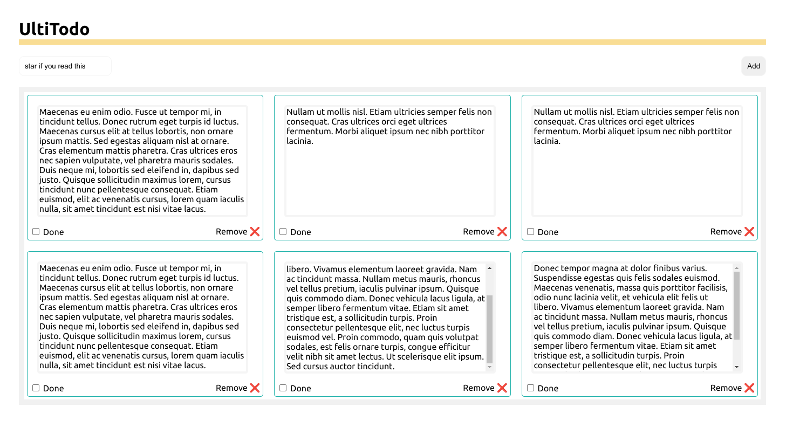
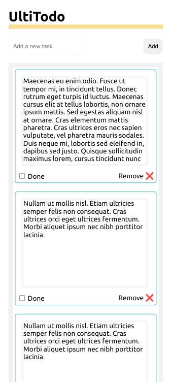

# UltiTodo App

> A simple to-do list in memory

### Desktop interface

### Mobile View

  

## Demo

You can visit the Demo on:

> https://ultirequiem.github.io/ultitodo

## Project Characteristic

- Has CD && CI

- Uses Svelte && TypeScript

## Licence

This is licensed under the MIT license.
